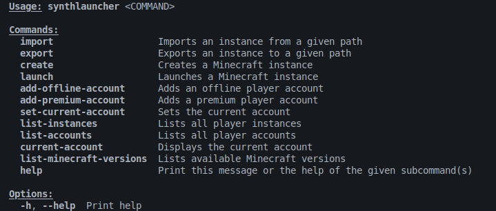

<p align="center">
  
</p>

<p align="center">  
  <strong>SynthLauncher</strong> is a free, open-source, feature-packed and lightweight Minecraft launcher.
</p>

<p align="center">
  <a href="https://www.gnu.org/licenses/gpl-3.0">
    
  </a>
  <a href="https://github.com/SynthLauncher/SynthLauncher">
    
  </a>
  <a href="https://github.com/SynthLauncher/SynthLauncher">
    
  </a>
</p>

## Current features

- **Modrinth and Curseforge support:** SynthLauncher has full support for installing modpacks, mods, resourcepacks and shaderpacks from Modrinth and Curseforge. 
- **Optimized performance:** SynthLauncher is designed to be fast, efficient, and lightweight.
- **Open-Source:** SynthLauncher is completely open-source, and open to contributors.

# Running the Code

You can run **SynthLauncher** either via the Command Line Interface (CLI) or the Graphical User Interface (GUI).

## Running via CLI

1. Open a terminal and navigate to the root directory of the project.

2. Run the following command to build and start the CLI version:

   ```bash
   cargo run
   ```

3. After running, you should see output similar to this:

   

4. To execute a command, run:

   ```bash
   cargo run <COMMAND>
   ```

## Running via GUI

The GUI is built using a frontend framework managed by `pnpm` and Tauri.

### Prerequisites

- [Node.js](https://nodejs.org/en/download/)
- [pnpm](https://pnpm.io/installation)

1. From the root directory, change to the frontend directory:

   ```bash
   cd crates/sl-frontend
   ```

2. Install dependencies:

   ```bash
   pnpm install
   ```

3. Run the development server with Tauri:

   ```bash
   pnpm run tauri dev
   ```

4. The GUI application should launch shortly after.

## Community

[](https://discord.gg/MbBGunfMJ4)

[](https://www.reddit.com/r/SynthLauncher)

## Contact

If you have any questions or need further assistance, feel free to reach out to us via the project's issue tracker, Email: [STierProgrammer@gmail.com](mailto:stierprogrammer@gmail.com) or Discord: `stierprogrammer`.

## Disclaimers

We are not affiliated with Mojang AB, Microsoft Corporation, and/or their affiliates.

## Privacy Policy (Updated November 17, 2025)

The launcher does **not** collect any data including but not limited to; usage analytics, personal information, etc.\

GitHub may, however, collect certain data (cookies) if you are navigating the site to download our launcher. We do not store or have access to any data that GitHub collects, and you may need to read [Github's privacy policies](https://docs.github.com/en/site-policy/privacy-policies) if you have any concerns.

## Inspired by:

1. [CrabLauncher](https://github.com/safiworks/CrabLauncher)
2. [QuantumLauncher](https://github.com/Mrmayman/quantum-launcher)
